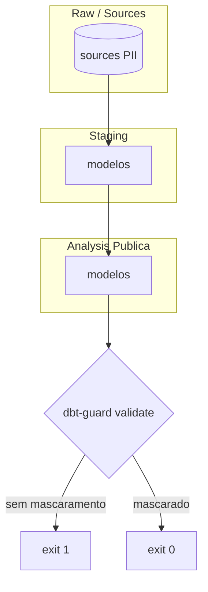

# dbt-guard

CLI em Go que audita o grafo de linhagem do dbt e bloqueia a publicação de dados sensíveis (PII) na camada de análise sem mascaramento, via contrato declarativo (sources + manifest) e conformidade com LGPD.

**Requisitos:** [Go 1.22+](https://go.dev/dl/)

---

## Visão geral

O dbt-guard lê o manifest.json do dbt (v10+) e os sources.yml, identifica fontes e nós com PII (meta.security_tag: pii), propaga a sensibilidade pelo grafo (DFS) e valida que modelos em analysis/ não exponham PII sem meta.masked: true. Indicado para CI como gate antes de merge.

### Camadas do dbt e ponto de bloqueio

Fluxo: Raw (sources) → Staging/Intermediate → Analysis (pública). O dbt-guard valida na fronteira da camada pública: se um modelo em `analysis/` descende de PII e não está mascarado, `validate` retorna exit 1.



Tabela de camadas e regras: [docs/README.md](docs/README.md#camadas-e-regras-de-governança).

## Estrutura do projeto

```
dbt-guard/
├── cmd/dbt-guard/       # CLI (main.go)
├── internal/
│   ├── parser/          # manifest.json, sources.yml, linhagem (DFS)
│   └── validator/       # Regras (analysis + mascaramento)
├── examples/            # Projeto dbt mínimo
├── scripts/test-e2e.sh
└── docs/
```

## Instalação

```bash
go build -o dbt-guard ./cmd/dbt-guard
```

Opcional: copiar o binário para um diretório no PATH (ex.: `~/go/bin`, `/usr/local/bin`).

## Uso

| Comando | Descrição |
|---------|-----------|
| `dbt-guard [pasta]` | Lista colunas PII a partir de `sources.yml`. |
| `dbt-guard manifest <manifest.json>` | Lista unique_id de nodes/sources que declaram PII. |
| `dbt-guard sensitive <manifest.json>` | Lista nós sensíveis (DFS). |
| `dbt-guard validate <manifest.json>` | Valida analysis/: exit 1 se modelo descende de PII sem meta.masked: true. |

Exemplo (raiz do repo): `./dbt-guard ./examples`, `./dbt-guard validate internal/parser/testdata/manifest_minimal.json`. Detalhes em [examples/README.md](examples/README.md).

## Testes

- **Unitários:** `go test ./...`
- **E2E (binário):** `./scripts/test-e2e.sh`
- **Manuais e cenário real:** [examples/README.md](examples/README.md)

## Contrato declarativo (PII no dbt)

O dbt-guard procura arquivos **`sources.yml`** e, em cada um, lê a estrutura `sources` → `tables` → `columns`. Uma coluna é considerada PII se tiver:

- **`meta.security_tag: pii`**, ou  
- **`config.meta.security_tag: pii`** (estilo dbt v1.10+)

Exemplo mínimo em uma coluna:

```yaml
columns:
  - name: email
    meta:
      security_tag: pii
```

## Documentação

| Documento | Conteúdo |
|-----------|----------|
| [docs/README.md](docs/README.md) | Arquitetura, fluxos, grafo de linhagem e camadas. |
| [docs/ROADMAP.md](docs/ROADMAP.md) | Status das fases (parser, DFS, validate). |
| [examples/README.md](examples/README.md) | Projeto dbt de exemplo e como testar. |

## Desenvolvimento

- **Testes:** `go test ./...` e `./scripts/test-e2e.sh`
- **Build:** `go build ./...` (debug: launch "Launch dbt-guard" no VS Code/Cursor).

---

## Roadmap

Status das fases (parser, DFS, validate): [docs/ROADMAP.md](docs/ROADMAP.md).

---

## Contribuição

1. Abra uma issue para bugs ou sugestões.
2. Envie um PR a partir da branch `main`; garanta que `go test ./...` e `go build ./...` passem.
3. Use `gofmt` e as regras de lint do projeto (ex.: staticcheck).

## Licença

Projeto em desenvolvimento; uso conforme política interna.
