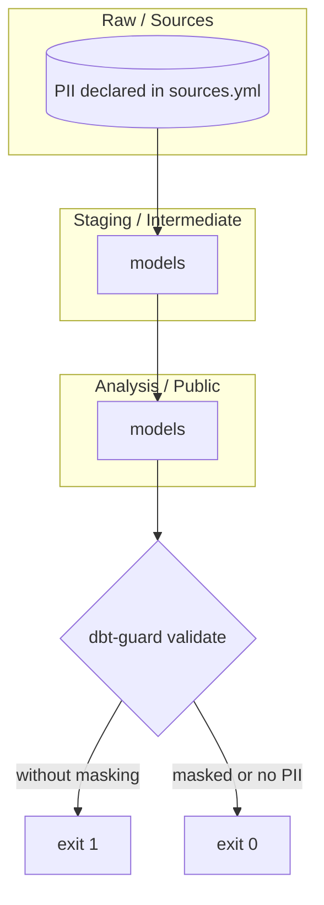

# dbt-guard

Governance CLI for [dbt](https://docs.getdbt.com/) projects. Audits lineage from `sources.yml` and `manifest.json`, propagates PII sensitivity through the dependency graph, and blocks unmasked sensitive data from reaching the public **analysis** layer.

Built for CI gates and data-contract enforcement (e.g. LGPD/GDPR-style PII controls).

**Requirements:** [Go 1.22+](https://go.dev/dl/)

---

## Features

- **Declarative PII contract** — tag sensitive columns in `sources.yml` (`meta.security_tag: pii`).
- **Manifest lineage** — reads dbt `manifest.json` (v10+) and walks `depends_on` edges.
- **Sensitivity propagation** — DFS marks every node that declares or inherits PII.
- **Analysis gate** — `validate` fails (exit 1) when a model under `analysis/` descends from PII without `meta.masked: true`.
- **Single binary** — no Python runtime; easy to install in CI and local workflows.

---

## How it works

Data flows from raw sources through staging/intermediate layers into the analysis (public) layer. **dbt-guard** runs at that boundary:


```mermaid
flowchart TB
  subgraph raw [Raw / Sources]
    R[(PII declared in sources.yml)]
  end
  subgraph staging [Staging / Intermediate]
    S[models]
  end
  subgraph analysis [Analysis / Public]
    A[models]
  end
  R --> S --> A
  A --> G{dbt-guard validate}
  G -->|without masking| B[exit 1]
  G -->|masked or no PII| O[exit 0]
```

| Layer | Role | Rule |
|-------|------|------|
| **Raw / Sources** | Contract in `sources.yml` | Columns tagged `meta.security_tag: pii`. |
| **Staging / Intermediate** | Refinement; may pass PII internally. | — |
| **Analysis** | Exposed to BI and reports. | Must not descend from PII unless `meta.masked: true`. |

Architecture and flow diagrams: [docs/README.md](docs/README.md).

---

## Quick start

```bash
git clone https://github.com/renatocruz/dbt-guard.git
cd dbt-guard
go build -o dbt-guard ./cmd/dbt-guard

# List PII columns from sources.yml
./dbt-guard ./examples

# Validate analysis layer (expect exit 1 on the sample project)
./dbt-guard validate internal/parser/testdata/manifest_minimal.json
```

---

## Installation

```bash
go build -o dbt-guard ./cmd/dbt-guard
```

Install globally (optional):

```bash
go install ./cmd/dbt-guard
# or: cp dbt-guard ~/go/bin/  or  /usr/local/bin/
```

Run without installing:

```bash
go run ./cmd/dbt-guard ./examples
```

---

## Usage

| Command | Description |
|---------|-------------|
| `dbt-guard [path]` | Print PII column names from `sources.yml` (recursive search). |
| `dbt-guard manifest <manifest.json>` | Print `unique_id` of nodes/sources that **declare** PII. |
| `dbt-guard sensitive <manifest.json>` | Print all **sensitive** nodes (declare PII or descend from PII), via DFS. |
| `dbt-guard validate <manifest.json>` | Gate **analysis/** models; exit 1 on unmasked PII lineage. |

### Example output (`validate`)

```
[dbt-guard] analysis model descends from PII without masking: model.dbt_guard_example.analysis_clientes
  lineage: model.dbt_guard_example.analysis_clientes -> model.dbt_guard_example.stg_clientes -> source.dbt_guard_example.raw.raw_clientes
```

### CI example (GitHub Actions)

```yaml
- name: dbt compile
  run: dbt compile
  working-directory: my_dbt_project

- name: dbt-guard validate
  run: dbt-guard validate my_dbt_project/target/manifest.json
```

---

## Declarative contract

In `sources.yml`, mark PII on columns:

```yaml
columns:
  - name: cpf
    meta:
      security_tag: pii
```

dbt v1.10+ style:

```yaml
columns:
  - name: email
    config:
      meta:
        security_tag: pii
```

To allow PII lineage into an analysis model, mark the **model** as masked in the manifest (via dbt `meta`):

```yaml
# in schema.yml or model config
meta:
  masked: true
```

---

## Project layout

```
dbt-guard/
├── cmd/dbt-guard/          # CLI entrypoint
├── internal/
│   ├── parser/             # manifest.json, sources.yml, lineage (DFS)
│   └── validator/          # analysis-layer rules
├── examples/               # minimal dbt project (source → staging → analysis)
├── scripts/test-e2e.sh     # end-to-end CLI tests
└── docs/                   # architecture, roadmap
```

---

## Development

```bash
go test ./...              # unit tests
./scripts/test-e2e.sh      # build + CLI smoke tests
go build ./...             # compile all packages
```

Sample dbt project and manual testing: [examples/README.md](examples/README.md).

Debug in VS Code/Cursor: launch configuration **"Launch dbt-guard"** (points at `examples/`).

---

## Documentation

| Document | Contents |
|----------|----------|
| [docs/README.md](docs/README.md) | Architecture, flows, lineage graph, layer rules. |
| [docs/ROADMAP.md](docs/ROADMAP.md) | Implementation status (parser, DFS, validate). |
| [examples/README.md](examples/README.md) | Example dbt project and test scenarios. |

---

## Roadmap

Phases 1–3 (manifest parser, DFS propagation, `validate` gate) are implemented. Details: [docs/ROADMAP.md](docs/ROADMAP.md).

---

## Contributing

1. Open an issue for bugs or feature requests.
2. Submit a PR against `main`; ensure `go test ./...` and `go build ./...` pass.
3. Run `gofmt`; follow project lint rules (e.g. staticcheck).

---

## License

Project under active development; use according to your organization's policy.
