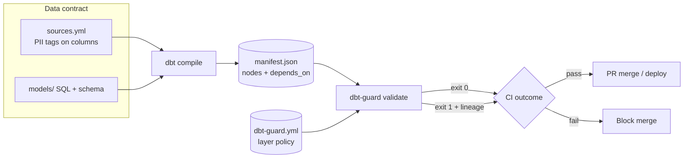
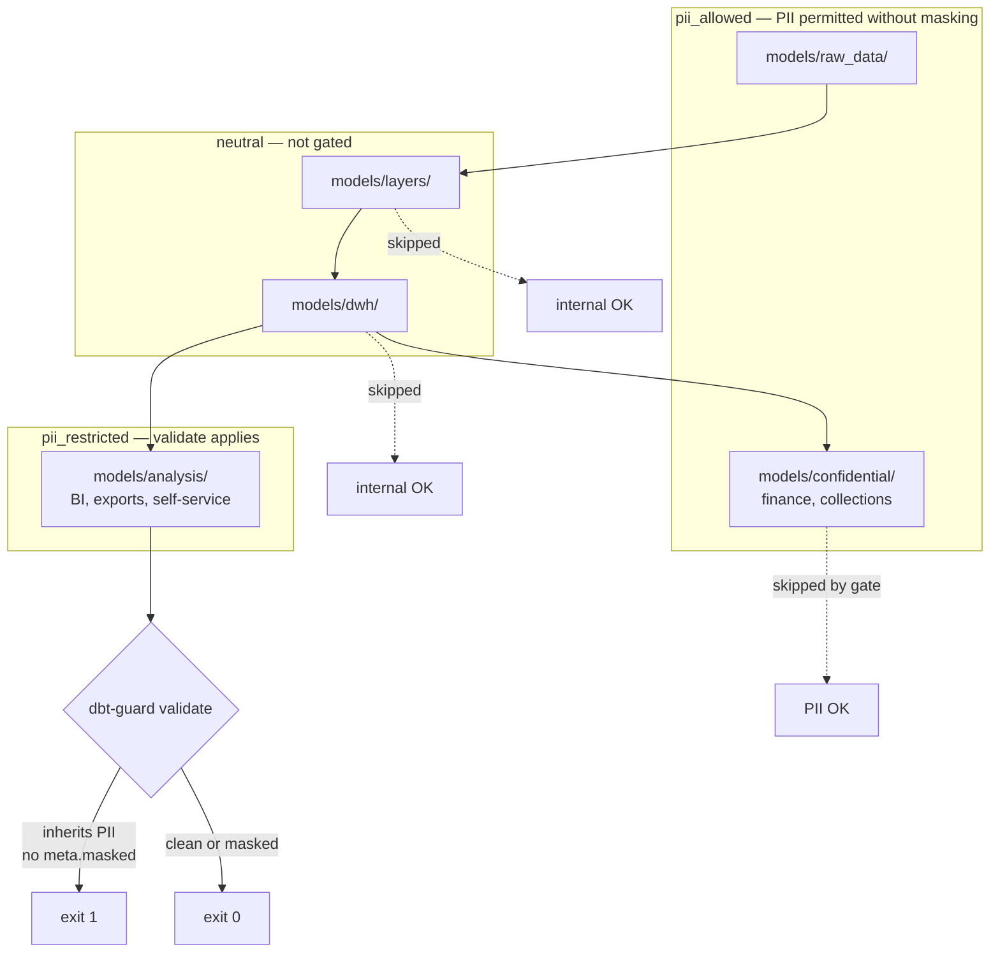
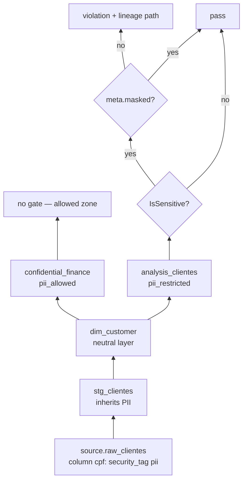
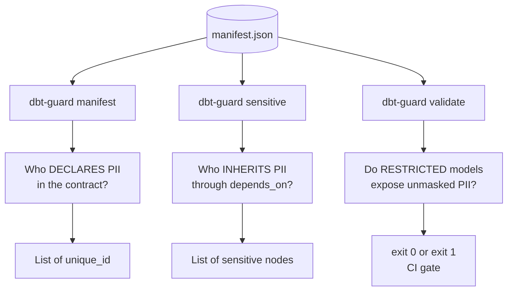
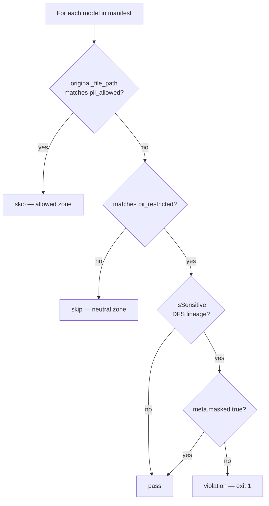

# dbt-guard

Governance CLI for [dbt](https://docs.getdbt.com/) projects. Audits lineage from `sources.yml` and `manifest.json`, propagates PII sensitivity through the dependency graph, and blocks unmasked sensitive data from reaching **restricted** consumption layers (configurable via `dbt-guard.yml`).

Built for CI gates and data-contract enforcement (e.g. LGPD/GDPR-style PII controls).

**Requirements:** [Go 1.22+](https://go.dev/dl/)

---

## Features

- **Declarative PII contract** — tag sensitive columns in `sources.yml` (`meta.security_tag: pii`).
- **Manifest lineage** — reads dbt `manifest.json` (v10+) and walks `depends_on` edges.
- **Sensitivity propagation** — DFS marks every node that declares or inherits PII.
- **Restricted-layer gate** — `validate` fails (exit 1) when a gated model descends from PII without `meta.masked: true`.
- **Configurable zones** — `pii_allowed`, `pii_restricted`, and neutral layers via `dbt-guard.yml`.
- **Single binary** — no Python runtime; easy to install in CI and local workflows.

---

## Where dbt-guard sits in your pipeline

dbt-guard runs **after** `dbt compile`, when the lineage graph is materialized in `manifest.json`. It does not execute SQL or connect to the warehouse.


```mermaid
flowchart LR
  subgraph contract [Data contract]
    SY[sources.yml<br/>PII tags on columns]
    MD[models/ SQL + schema]
  end

  DC[dbt compile]
  MF[(manifest.json<br/>nodes + depends_on)]
  POL[(dbt-guard.yml<br/>layer policy)]
  DG[dbt-guard validate]
  OUT{CI outcome}

  SY --> DC
  MD --> DC
  DC --> MF
  MF --> DG
  POL --> DG
  DG -->|exit 0| OUT
  DG -->|exit 1 + lineage| OUT

  OUT -->|pass| MERGE[PR merge / deploy]
  OUT -->|fail| BLOCK[Block merge]
```

---

## Warehouse zones and layer policy

Map your dbt folder structure to governance zones. Only **restricted** layers are gated; **allowed** layers explicitly permit PII; everything else is **neutral** (internal traffic, no gate).


```mermaid
flowchart TB
  subgraph allowed ["pii_allowed — PII permitted without masking"]
    RAW["models/raw_data/"]
    CONF["models/confidential/<br/>finance, collections"]
  end

  subgraph neutral ["neutral — not gated"]
    LAY["models/layers/"]
    DWH["models/dwh/"]
  end

  subgraph restricted ["pii_restricted — validate applies"]
    ANA["models/analysis/<br/>BI, exports, self-service"]
  end

  RAW --> LAY
  LAY --> DWH
  DWH --> CONF
  DWH --> ANA

  ANA --> GATE{dbt-guard validate}
  GATE -->|inherits PII<br/>no meta.masked| FAIL["exit 1"]
  GATE -->|clean or masked| PASS["exit 0"]

  CONF -.->|skipped by gate| OK1["PII OK"]
  LAY -.->|skipped| OK2["internal OK"]
  DWH -.->|skipped| OK3["internal OK"]
```

| Zone | Typical use | Policy | validate behavior |
|------|-------------|--------|-------------------|
| **raw_data** | Landing, source mirrors | `pii_allowed` | Skipped — PII declared here |
| **layers / dwh** | Internal refinement | *(neutral)* | Skipped — not a consumption boundary |
| **confidential** | Regulated internal domains | `pii_allowed` | Skipped — PII explicitly allowed |
| **analysis** | BI, dashboards, exports | `pii_restricted` | **Gated** — unmasked PII lineage fails |

Full architecture: [docs/README.md](docs/README.md).

---

## Lineage propagation and the gate

PII is declared at the **source**. Sensitivity **propagates downstream** through every model that depends on it. The gate only evaluates models in **restricted** folders.


```mermaid
flowchart BT
  SRC["source.raw_clientes<br/>column cpf: security_tag pii"]
  STG["stg_clientes<br/>inherits PII"]
  DWH["dim_customer<br/>neutral layer"]
  CF["confidential_finance<br/>pii_allowed"]
  ANA["analysis_clientes<br/>pii_restricted"]

  SRC --> STG
  STG --> DWH
  DWH --> CF
  DWH --> ANA

  CF --> R1["no gate — allowed zone"]
  ANA --> R2{IsSensitive?}
  R2 -->|yes| R3{meta.masked?}
  R3 -->|no| R4["violation + lineage path"]
  R3 -->|yes| R5["pass"]
  R2 -->|no| R5
```

Example violation path:

```
analysis_clientes -> stg_clientes -> source.raw_clientes
```

---

## Three commands, three questions

Use the right command depending on what you need to audit or enforce.


```mermaid
flowchart TB
  IN[(manifest.json)]

  IN --> CMD1[dbt-guard manifest]
  IN --> CMD2[dbt-guard sensitive]
  IN --> CMD3[dbt-guard validate]

  CMD1 --> Q1["Who DECLARES PII<br/>in the contract?"]
  CMD2 --> Q2["Who INHERITS PII<br/>through depends_on?"]
  CMD3 --> Q3["Do RESTRICTED models<br/>expose unmasked PII?"]

  Q1 --> O1[List of unique_id]
  Q2 --> O2[List of sensitive nodes]
  Q3 --> O3["exit 0 or exit 1<br/>CI gate"]
```

| Command | Scope | Use when |
|---------|-------|----------|
| `manifest` | Declared PII only | Auditing the contract; no lineage walk |
| `sensitive` | Declared + inherited PII | Impact analysis; "what is touched by this source?" |
| `validate` | Restricted layers only | **PR/CI gate** before merge or deploy |

Directory mode (`dbt-guard [path]`) scans `sources.yml` **before** compile — useful to verify column tags without a manifest.

---

## Quick start

```bash
git clone https://github.com/renatocruz/dbt-guard.git
cd dbt-guard
go build -o dbt-guard ./cmd/dbt-guard

# PII columns from sources.yml
./dbt-guard ./examples

# CI gate on sample fixture (expect exit 1)
./dbt-guard validate internal/parser/testdata/manifest_minimal.json
```

---

## Installation

```bash
go build -o dbt-guard ./cmd/dbt-guard
```

Install globally (optional):

```bash
go install ./cmd/dbt-guard
# or: cp dbt-guard ~/go/bin/  or  /usr/local/bin/
```

Run without installing:

```bash
go run ./cmd/dbt-guard ./examples
```

---

## Usage

| Command | Description |
|---------|-------------|
| `dbt-guard [path]` | Print PII column names from `sources.yml` (recursive search). |
| `dbt-guard manifest <manifest.json>` | Print `unique_id` of nodes/sources that **declare** PII. |
| `dbt-guard sensitive <manifest.json>` | Print all **sensitive** nodes (declare or inherit PII), via DFS. |
| `dbt-guard validate <manifest.json>` | Gate **restricted** layers; exit 1 on unmasked PII lineage. |
| `dbt-guard validate --config dbt-guard.yml <manifest.json>` | Apply custom layer policy from YAML. |
| `dbt-guard validate --allowed confidential --restricted analysis <manifest.json>` | CLI layer overrides (comma-separated). |

### Example output (`validate`)

```
[dbt-guard] model in restricted layer descends from PII without masking: model.dbt_guard_example.analysis_clientes
  lineage: model.dbt_guard_example.analysis_clientes -> model.dbt_guard_example.stg_clientes -> source.dbt_guard_example.raw.raw_clientes
```

### Layer policy (`dbt-guard.yml`)

Default (no config): only paths containing `/analysis/` are restricted.

```yaml
layers:
  pii_allowed:
    - "/models/raw_data/"
    - "/models/confidential/"   # finance, collections — PII OK
  pii_restricted:
    - "/models/analysis/"       # exposed BI — block unmasked PII
  # layers/, dwh/, etc. omitted → neutral (internal, not gated)
```

```bash
dbt-guard validate target/manifest.json --config dbt-guard.yml
```

Paths match `original_file_path` in the manifest (e.g. `models/analysis/foo.sql`). **Allowed takes precedence** over restricted when both match. Example: [examples/dbt-guard.yml](examples/dbt-guard.yml).

### How validate decides (per model)


```mermaid
flowchart TD
  START[For each model in manifest] --> PATH{original_file_path<br/>matches pii_allowed?}
  PATH -->|yes| SKIP1[skip — allowed zone]
  PATH -->|no| REST{matches pii_restricted?}
  REST -->|no| SKIP2[skip — neutral zone]
  REST -->|yes| SENS{IsSensitive<br/>DFS lineage?}
  SENS -->|no| PASS[pass]
  SENS -->|yes| MASK{meta.masked true?}
  MASK -->|yes| PASS
  MASK -->|no| FAIL[violation — exit 1]
```

### CI example (GitHub Actions)

```yaml
- name: dbt compile
  run: dbt compile
  working-directory: my_dbt_project

- name: dbt-guard validate
  run: dbt-guard validate my_dbt_project/target/manifest.json --config my_dbt_project/dbt-guard.yml
```

---

## Declarative contract

In `sources.yml`, mark PII on columns:

```yaml
columns:
  - name: cpf
    meta:
      security_tag: pii
```

dbt v1.10+ style:

```yaml
columns:
  - name: email
    config:
      meta:
        security_tag: pii
```

To permit PII lineage in a **restricted** model, set model-level masking (via `schema.yml` or model config):

```yaml
meta:
  masked: true
```

---

## Project layout

```
dbt-guard/
├── cmd/dbt-guard/          # CLI entrypoint
├── internal/
│   ├── config/             # LayerPolicy, dbt-guard.yml loader
│   ├── parser/             # manifest.json, sources.yml, lineage (DFS)
│   └── validator/          # restricted-layer gate rules
├── examples/               # minimal dbt project + sample dbt-guard.yml
├── scripts/test-e2e.sh     # end-to-end CLI tests
└── docs/                   # architecture, testing, roadmap
```

---

## Development

```bash
go test ./...              # unit tests
./scripts/test-e2e.sh      # build + CLI smoke tests
go build ./...             # compile all packages
```

Sample dbt project and manual testing: [examples/README.md](examples/README.md).

Debug in VS Code/Cursor: launch configuration **"Launch dbt-guard"** (points at `examples/`).

---

## Documentation

| Document | Contents |
|----------|----------|
| [docs/README.md](docs/README.md) | Architecture, flows, lineage graph, layer rules. |
| [docs/TESTING.md](docs/TESTING.md) | Unit, E2E, and real-world test scenarios. |
| [docs/ROADMAP.md](docs/ROADMAP.md) | Implementation status (parser, DFS, validate). |
| [examples/README.md](examples/README.md) | Example dbt project and test scenarios. |

---

## Roadmap

Phases 1–3 (manifest parser, DFS propagation, `validate` gate + layer policy) are implemented. Details: [docs/ROADMAP.md](docs/ROADMAP.md).

---

## Contributing

1. Open an issue for bugs or feature requests.
2. Submit a PR against `main`; ensure `go test ./...` and `go build ./...` pass.
3. Run `gofmt`; follow project lint rules (e.g. staticcheck).

---

## License

Project under active development; use according to your organization's policy.
