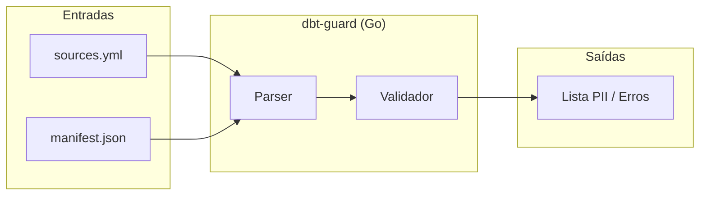
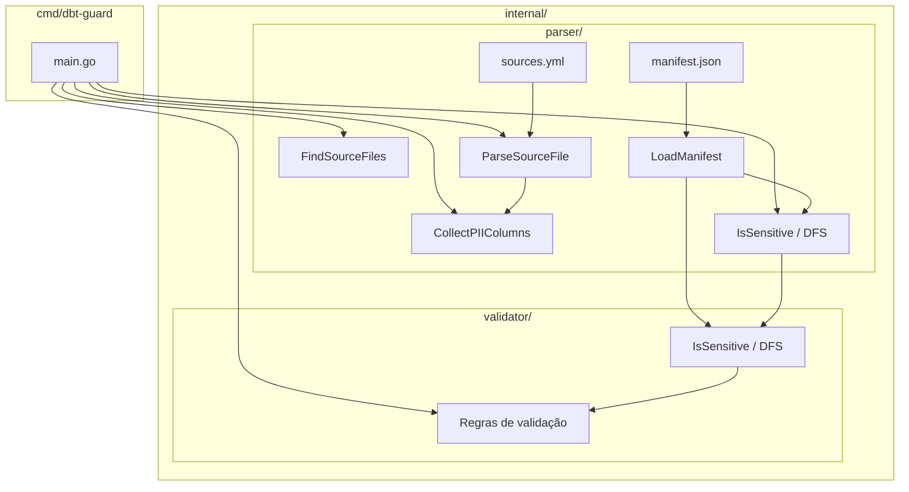
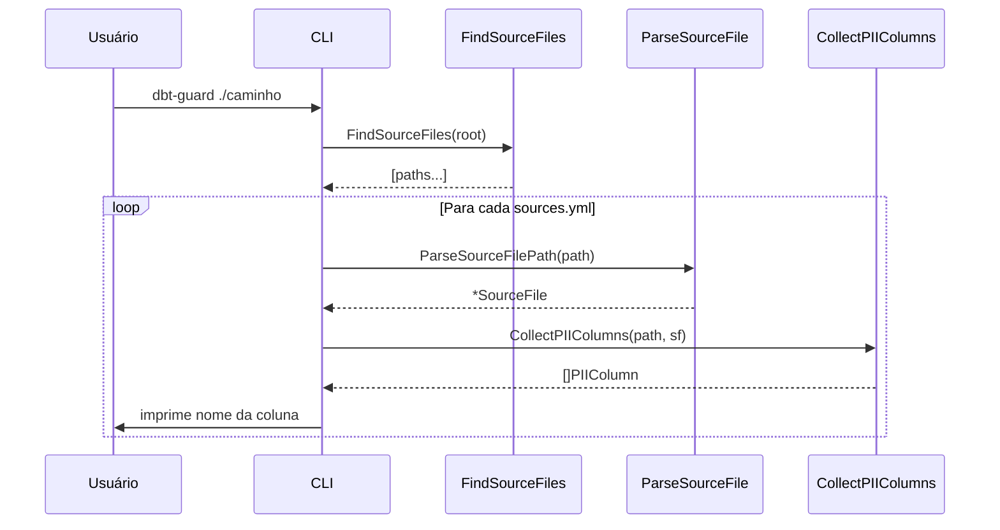
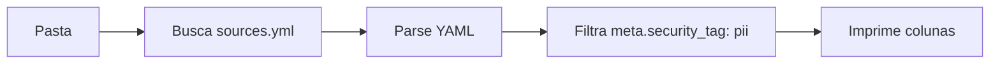
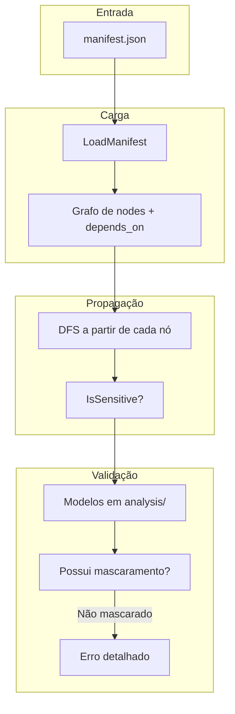
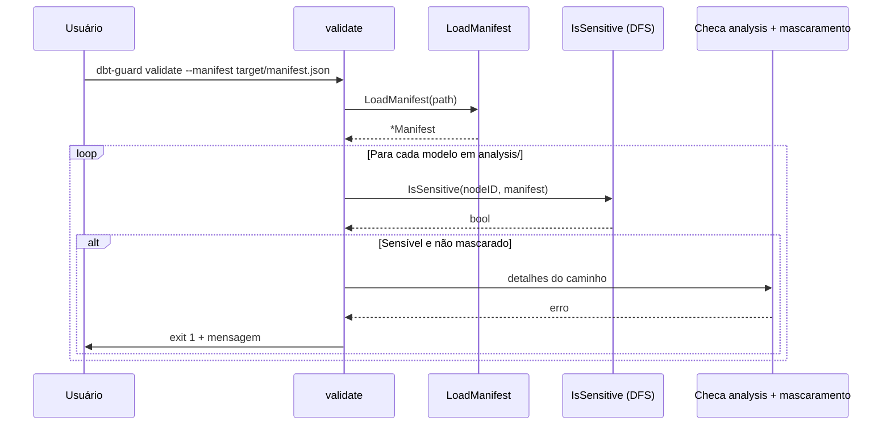
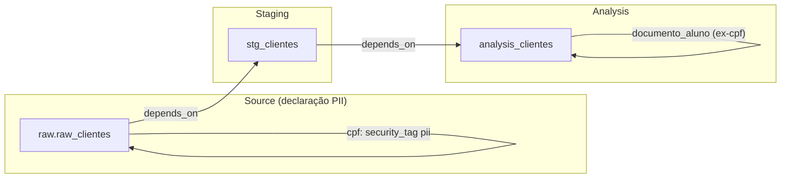
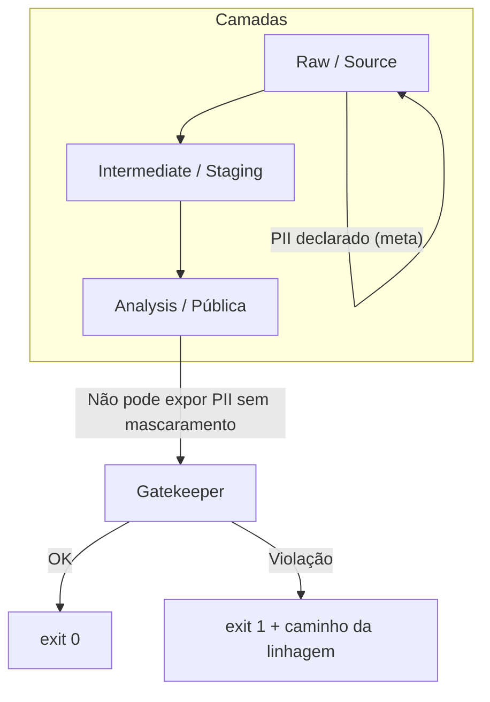

# Arquitetura e fluxo do dbt-guard

Este documento descreve a arquitetura do projeto e os fluxos de dados (atual e planejado).

---

## Visão geral

O dbt-guard é uma CLI de governança que usa **contrato declarativo** (YAML/JSON do dbt) para auditar linhagem e impedir que PII alcance camadas públicas sem mascaramento.

---

## Arquitetura de componentes

| Componente | Responsabilidade |
|------------|------------------|
| **CLI** | Recebe pasta ou caminho do manifest, invoca parser e validador, imprime resultado ou sai com código de erro. |
| **Parser** | Lê `sources.yml` (recursivo) e `manifest.json`; expõe structs (SourceFile, Manifest, ManifestNode, SourceDef) e funções de busca/coleta de PII e de IDs com PII no manifest. |
| **Validator** | (Em evolução) Aplica regras: propagação de sensibilidade (DFS), checagem de mascaramento, validação da camada `analysis`. |

---

## Fluxo atual

### Modo sources.yml

O dbt-guard percorre uma pasta, encontra todos os `sources.yml`, faz parse e imprime o nome das colunas com `security_tag: pii`.

### Modo manifest (Fase 1)

O comando `dbt-guard manifest <path>` carrega o `manifest.json` do dbt (v10+), identifica **nodes** e **sources** com tag PII (em `meta` ou em colunas) e imprime seus `unique_id`. Estruturas em `internal/parser/manifest.go`: `Manifest`, `ManifestNode`, `SourceDef`, `DependsOn`, `LoadManifest`, `NodeIDsWithPII`, `SourceIDsWithPII`.

### Modo sensitive (Fase 2 — DFS)

O comando `dbt-guard sensitive <path>` carrega o manifest e imprime os `unique_id` de **todos** os nós e sources que são sensíveis: os que declaram PII ou que **descendem** (via `depends_on`) de algum que declara. A função **`IsSensitive(nodeID, manifest)`** em `internal/parser/lineage.go` percorre o grafo em DFS a partir de cada nó, seguindo os parents; usa cache por nodeID para evitar ciclos e reavaliação.

### Modo validate (Fase 3 — Gatekeeper)

O comando **`dbt-guard validate <path>`** carrega o manifest, identifica modelos em **`analysis/`** (por `original_file_path`), e para cada um que **descende de PII** (IsSensitive) e **não** está mascarado (`meta.masked: true` ou `config.meta.masked: true`) retorna um erro detalhado com o `unique_id` do modelo e o **caminho da linhagem** até a source/nó PII (`LineagePathToPII`). Usado em CI para impedir que PII chegue à camada de análise sem mascaramento.

---

## Fluxo alvo (manifest + validação)

Após o roadmap (Fase 1–3), o fluxo principal será: carregar o manifest, construir o grafo de linhagem, propagar PII por DFS e validar a camada `analysis`.

---

## Grafo de linhagem (exemplo)

O manifest do dbt descreve um **grafo direcionado**: sources e modelos são nós; `depends_on` são arestas. A propagação de PII sobe das sources (onde está declarado no YAML) até os modelos que dependem delas.

- **Source:** PII declarado em `sources.yml` (ex.: `cpf` com `meta.security_tag: pii`).
- **Staging:** depende da source; herda sensibilidade.
- **Analysis:** depende do staging; se expuser coluna PII sem tag de mascaramento, o validador deve falhar e reportar o caminho (ex.: `analysis_clientes` ← `stg_clientes` ← `raw.raw_clientes`).

---

## Camadas e regras de governança

| Camada | Papel | Regra |
|--------|--------|--------|
| **Source** | Contrato declarativo (sources.yml) | Colunas sensíveis com `meta.security_tag: pii`. |
| **Staging / Intermediate** | Refinamento; pode repassar PII para camadas internas. | — |
| **Analysis** | Dados expostos para consumo (relatórios, BI). | Não pode descender de PII sem estar explicitamente mascarado; caso contrário, o `validate` falha. |

---

## Resumo

| Artefato | Função |
|----------|--------|
| **sources.yml** | Declara quais colunas são PII (contrato). |
| **manifest.json** | Grafo de nós e `depends_on` (linhagem). |
| **Parser** | Lê YAML e JSON; expõe structs e listas de colunas PII. |
| **DFS / IsSensitive** | Propaga sensibilidade da source até o nó (grafo). |
| **validate** | Garante que modelos em `analysis/` que descendem de PII tenham mascaramento; senão, erro com caminho da linhagem. |

Os diagramas usam [Mermaid](https://mermaid.js.org/). Eles são renderizados no GitHub, no GitLab e em editores que suportam Mermaid (VS Code, Cursor com extensão).
