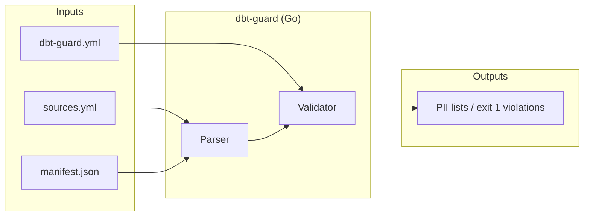
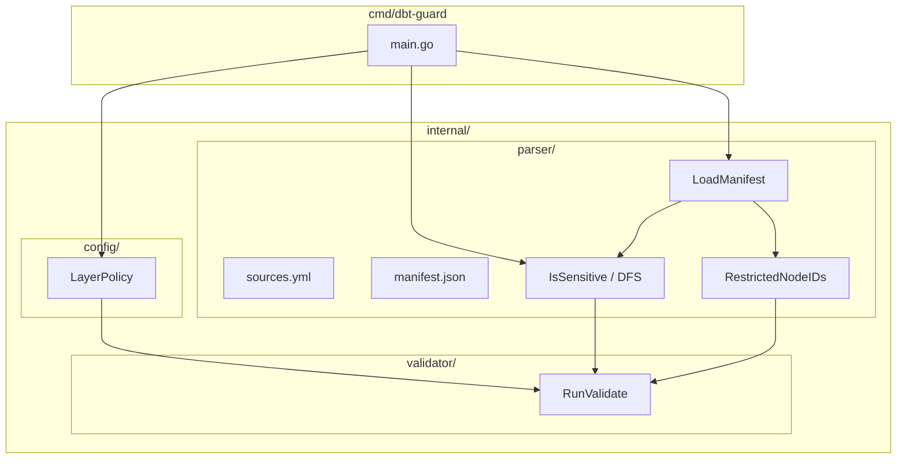
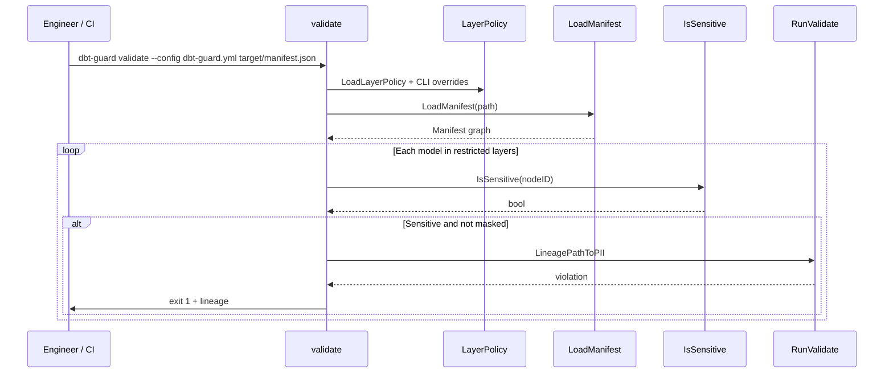
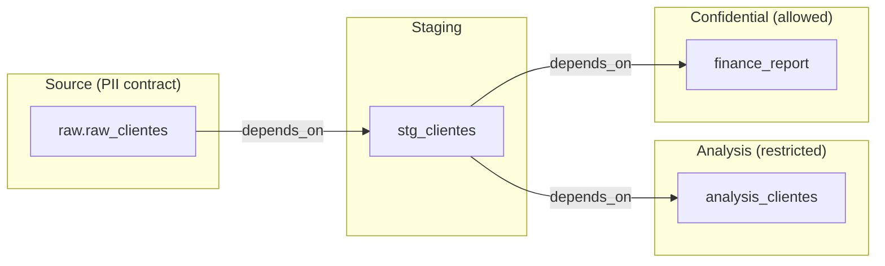
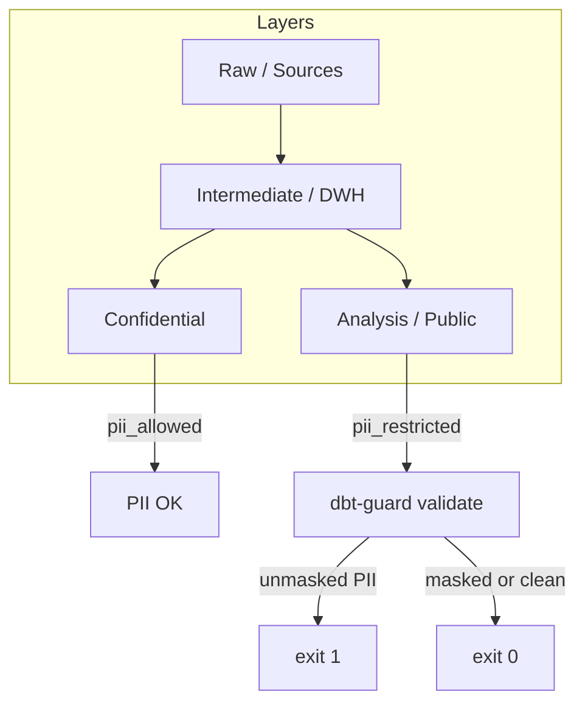

# Architecture and data flows

Technical reference for data engineers operating dbt-guard as a **governance gate** on dbt lineage. The tool enforces a declarative PII contract (`sources.yml` + `manifest.json`) before models reach restricted consumption layers.

---

## Overview

dbt-guard is a Go CLI that:

1. Reads **PII declarations** from `sources.yml` and the dbt **manifest** (v10+).
2. Builds a **directed lineage graph** from `depends_on`.
3. **Propagates sensitivity** upstream-to-downstream via DFS (`IsSensitive`).
4. **Gates restricted layers** on `validate`: models that inherit PII without explicit masking fail CI.


```mermaid
flowchart LR
    subgraph Inputs
        A[sources.yml]
        B[manifest.json]
        C[dbt-guard.yml]
    end
    subgraph dbt_guard["dbt-guard (Go)"]
        P[Parser]
        V[Validator]
    end
    subgraph Outputs
        E[PII lists / exit 1 violations]
    end
    A --> P
    B --> P
    C --> V
    P --> V
    V --> E
```

---

## Component architecture


```mermaid
flowchart TB
    subgraph CLI["cmd/dbt-guard"]
        M[main.go]
    end

    subgraph Internal["internal/"]
        subgraph Config["config/"]
            LP[LayerPolicy]
        end
        subgraph Parser["parser/"]
            P1[sources.yml]
            P2[manifest.json]
            P5[LoadManifest]
            P7[IsSensitive / DFS]
            P8[RestrictedNodeIDs]
        end
        subgraph Validator["validator/"]
            V1[RunValidate]
        end
    end

    M --> P5
    M --> P7
    M --> LP
    LP --> V1
    P5 --> P7
    P5 --> P8
    P7 --> V1
    P8 --> V1
```

| Component | Responsibility |
|-----------|----------------|
| **CLI** | Dispatches commands; loads optional `dbt-guard.yml`; exits non-zero on policy violations. |
| **config** | `LayerPolicy`: `pii_allowed`, `pii_restricted`; path matching on `original_file_path`. |
| **parser** | Parses YAML/JSON; exposes manifest structs; implements lineage DFS and PII collection. |
| **validator** | Applies layer policy + sensitivity + masking rules; returns violations with lineage paths. |

---

## CLI modes

### Directory mode (`dbt-guard [path]`)

Recursively finds `sources.yml`, parses column metadata, prints column names tagged `meta.security_tag: pii`. Useful for auditing the **data contract** before compile.

### `manifest` — declared PII

Loads `manifest.json`, prints `unique_id` of nodes/sources that **declare** PII (column meta or node meta). Does not walk lineage.

Implementation: `internal/parser/manifest.go` — `LoadManifest`, `NodeIDsWithPII`, `SourceIDsWithPII`.

### `sensitive` — propagated PII (DFS)

Prints every node/source that **declares or inherits** PII by walking `depends_on` parents.

Implementation: `internal/parser/lineage.go` — `IsSensitive` with per-node cache.

### `validate` — restricted-layer gatekeeper

```bash
dbt-guard validate target/manifest.json [--config dbt-guard.yml] [--allowed a,b] [--restricted x,y]
```

For each model in a **restricted** layer (and not in an **allowed** layer):

1. If `IsSensitive(nodeID)` is true, and
2. `meta.masked: true` (or `config.meta.masked`) is not set,

→ record a violation with `LineagePathToPII` and exit 1.

**Default policy** (no config): only paths containing `/analysis/` are restricted (backward compatible).

**Custom policy** (`dbt-guard.yml`):

```yaml
layers:
  pii_allowed:
    - "/models/raw_data/"
    - "/models/confidential/"
  pii_restricted:
    - "/models/analysis/"
```

| Policy list | Effect on models matching `original_file_path` |
|-------------|-----------------------------------------------|
| `pii_allowed` | Skip validation; unmasked PII lineage is permitted. |
| `pii_restricted` | Gate applies; unmasked PII lineage fails. |
| *(omitted)* | **Neutral** — internal layers (`dwh`, `layers`); no gate. |

Allowed patterns take precedence when both lists match.

---

## Validate sequence


```mermaid
sequenceDiagram
    participant U as Engineer / CI
    participant CLI as validate
    participant CFG as LayerPolicy
    participant Load as LoadManifest
    participant DFS as IsSensitive
    participant Gate as RunValidate

    U->>CLI: dbt-guard validate --config dbt-guard.yml target/manifest.json
    CLI->>CFG: LoadLayerPolicy + CLI overrides
    CLI->>Load: LoadManifest(path)
    Load-->>CLI: Manifest graph
    loop Each model in restricted layers
        CLI->>DFS: IsSensitive(nodeID)
        DFS-->>CLI: bool
        alt Sensitive and not masked
            CLI->>Gate: LineagePathToPII
            Gate-->>CLI: violation
            CLI->>U: exit 1 + lineage
        end
    end
```

---

## Lineage graph (example)

The dbt manifest is a **directed acyclic graph**: sources and models are nodes; `depends_on.nodes` are edges pointing to parents.


```mermaid
flowchart LR
    subgraph Source["Source (PII contract)"]
        S[raw.raw_clientes]
    end
    subgraph Staging
        ST[stg_clientes]
    end
    subgraph Analysis["Analysis (restricted)"]
        AN[analysis_clientes]
    end
    subgraph Confidential["Confidential (allowed)"]
        CF[finance_report]
    end
    S -->|depends_on| ST
    ST -->|depends_on| AN
    ST -->|depends_on| CF
```

- **Source:** PII declared in `sources.yml` (`cpf` → `security_tag: pii`).
- **Staging:** inherits sensitivity; neutral layer (no gate unless configured).
- **Analysis:** restricted by default; unmasked PII → violation.
- **Confidential:** allowed when listed in `pii_allowed`; PII permitted for finance/collections use cases.

---

## Layer governance model


```mermaid
flowchart TB
    subgraph Layers
        direction TB
        R[Raw / Sources]
        I[Intermediate / DWH]
        C[Confidential]
        A[Analysis / Public]
    end
    R --> I
    I --> C
    I --> A
    C -->|"pii_allowed"| OK1[PII OK]
    A -->|"pii_restricted"| G[dbt-guard validate]
    G -->|unmasked PII| FAIL[exit 1]
    G -->|masked or clean| OK2[exit 0]
```

Typical warehouse layout for a data platform team:

| Layer folder | Governance role | dbt-guard policy |
|--------------|-------------------|------------------|
| `models/raw_data/` | Landing / sources mirror | Usually `pii_allowed` (contract origin) |
| `models/layers/`, `models/dwh/` | Internal refinement | Neutral (default) |
| `models/confidential/` | Regulated internal consumers | `pii_allowed` |
| `models/analysis/` | BI, self-service, exports | `pii_restricted` |

Path matching uses `original_file_path` from the manifest (e.g. `models/analysis/report.sql`). Patterns are normalized to segment form (`/analysis/`).

---

## Artifact reference

| Artifact | Role in governance |
|----------|-------------------|
| `sources.yml` | Declares which columns are PII (upstream contract). |
| `manifest.json` | Authoritative lineage graph after `dbt compile`. |
| `dbt-guard.yml` | Layer allow/restrict policy for your warehouse zones. |
| `meta.masked: true` | Explicit approval for PII lineage in a restricted model. |
| Parser / DFS | Computes inherited sensitivity independent of layer policy. |
| `validate` | Enforces policy only on restricted layers; reports lineage on failure. |

Diagrams use [Mermaid](https://mermaid.js.org/) (rendered on GitHub, GitLab, VS Code, Cursor).
